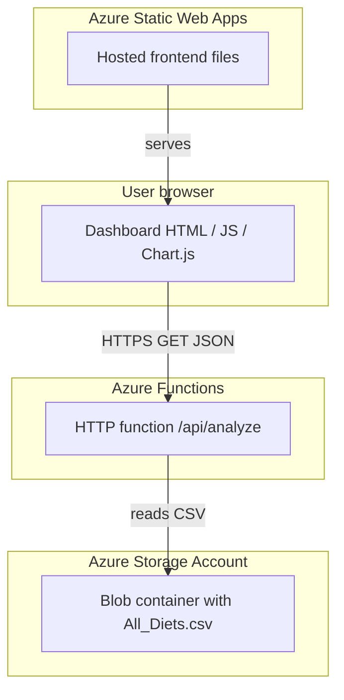

# System architecture

## High-level diagram

## Request flow

1. The user opens the dashboard URL served by **Azure Static Web Apps** (static `index.html`, `app.js`, `style.css`).
2. The browser runs JavaScript that calls **`GET /api/analyze`** on the **Azure Function App** (full HTTPS URL).
3. The function loads the diets dataset (from **Blob Storage** when configured in Azure, or from the local `All_Diets.csv` file during local development), aggregates averages by `Diet_type`, and returns JSON:
   - `macrosByDiet.labels`, `protein`, `carbs`, `fat`
   - `executionTimeMs`
4. Chart.js renders bar, line, and doughnut charts and displays execution time on the page.

## Components

### Frontend (Person 2)

- **Role:** Call the API, parse JSON, render charts and filters, show `executionTimeMs`.
- **Files:** `frontend/index.html`, `frontend/app.js`, `frontend/style.css`.
- **Cloud note:** When the page is **not** opened from `localhost`, `app.js` uses `CLOUD_ANALYZE_URL` (set by Person 3 after deployment).

### Backend (Person 1)

- **Role:** Expose `GET /api/analyze` returning JSON; measure wall-clock time for the analysis.
- **Files:** `backend/function_app.py`, `backend/requirements.txt`, `backend/host.json`.
- **Cloud note:** In Azure, application settings can point the function at the blob that holds `All_Diets.csv` (see `DEPLOYMENT.md`).

### Cloud infrastructure (Person 3)

- **Resource group:** Groups all related resources.
- **Storage account + blob container:** Holds `All_Diets.csv` for the deployed pipeline.
- **Function App:** Hosts the Python function; provides the public HTTPS endpoint.
- **Static Web App:** Hosts the dashboard static site.

## Security and networking notes

- The browser calls the Function URL from a **different origin** than the Static Web App; **CORS** must allow the Static Web App origin on the Function App (see `DEPLOYMENT.md`).
- Prefer **HTTPS** everywhere for production URLs.
